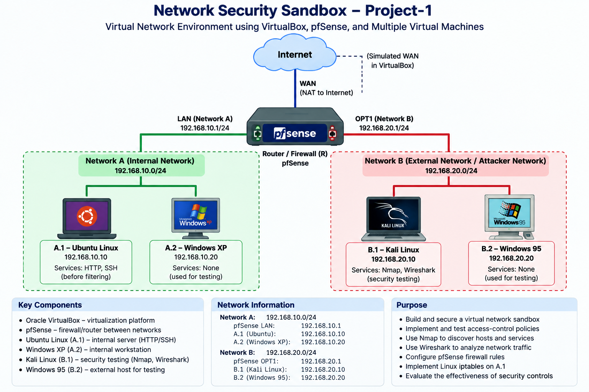

# Network Security Sandbox: Firewall & Access Control

## Overview

This project demonstrates the design, implementation, and testing of a virtual network security sandbox.

The environment was built using VirtualBox and consisted of two isolated networks connected through a pfSense firewall/router. Network security policies were implemented and verified using Nmap, Wireshark, pfSense firewall rules, and Linux iptables.

The project focused on network segmentation, service discovery, firewall configuration, access control, and packet-level traffic analysis.

## Network Architecture

### Network A — Internal Network
- Ubuntu Linux server
- Windows XP workstation

### Network B — External Network
- Kali Linux security/testing machine
- Windows 95 machine

### Router / Firewall
- pfSense

The pfSense router connected Network A and Network B and enforced communication policies between the two networks.

## Technologies Used

- Oracle VirtualBox
- pfSense
- Ubuntu Linux
- Kali Linux
- Windows XP
- Windows 95
- Nmap
- Wireshark
- Linux iptables
- TCP/IP
- HTTP
- SSH
- ICMP

## Security Testing

The environment was tested using:

- Nmap for host and service discovery
- Wireshark for packet analysis
- Ping for ICMP connectivity testing
- HTTP requests for web-service testing
- SSH for remote-service testing

Testing was performed before and after firewall implementation to determine how the security controls affected network communication.

## Firewall Implementation

Network-level access-control rules were implemented using pfSense.

Additional host-level firewall rules were implemented on the Ubuntu server using Linux iptables for traffic that could not be fully controlled by the network router, particularly communication between hosts located on the same subnet.

## Key Results

The security controls successfully restricted unauthorized communication between the internal and external networks while maintaining permitted services.

After firewall implementation:

- External systems could access the permitted HTTP service on the internal server.
- Unauthorized SSH access from the external network was blocked.
- External ICMP access to internal systems was restricted.
- Services on the internal workstation were protected from the external network.
- Host-based firewall rules provided additional protection for same-subnet communication.

## Skills Demonstrated

- Network security
- Virtual networking
- Network segmentation
- Firewall configuration
- Access-control policy design
- Linux firewall administration
- Network scanning
- Packet analysis
- TCP/IP troubleshooting
- Security testing

## Project Context

This project was completed as part of Computer Security coursework at Texas State University.

The initial virtual environment setup and network/service configuration were completed individually. Security-policy development, firewall implementation, testing, and verification were completed collaboratively as part of a three-person team.
